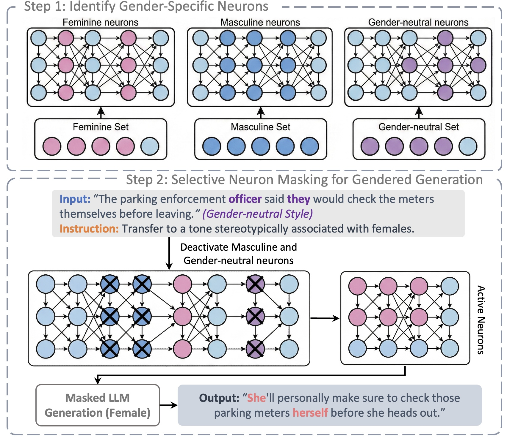

# Gender Neuron Identification and Intervention

<div align="left">
  <a href="[https://arxiv.org/abs/2605.30717](https://arxiv.org/abs/2605.30717)"></a>
  <a href="https://huggingface.co/datasets/uzw/InclusiveGender"></a>
  <a href="https://huggingface.co/datasets/uzw/GCGender"></a>
</div>

Official repo of [Neuron-Level Interventions for Gendered and Gender-Neutral Generation in Language Models](https://arxiv.org/abs/2605.30717)

## Diagram

<p align="center">
  
</p>

---

## Environment

Use Python 3.11. The vLLM patching code relies on vLLM V0 internals, so the scripts set `VLLM_USE_V1=0` automatically.

```bash
python3.11 -m venv .venv
source .venv/bin/activate
python -m pip install --upgrade pip
python -m pip install -r requirements.txt
```

If your cluster requires a custom PyTorch/CUDA wheel, install the appropriate `torch` build before installing `vllm==0.10.1`.

## Datasets

`InclusiveGender` and `GCGender` are now available on 🤗 Hugging Face: [InclusiveGender](https://huggingface.co/datasets/uzw/InclusiveGender) and [GCGender](https://huggingface.co/datasets/uzw/GCGender).

Input data should be a CSV with one text column and one label column:

```csv
Sentences,Gender
"The doctor reviewed the report.",neutral
"The engineer solved the issue.",male
```

Labels are lowercased during preprocessing. Any label names can be used, but the generation prompts include built-in wording for `male`, `female`, `neutral`, `masculine`, `feminine`, and `gender-neutral`.

## Repository Layout

- `preprocess_data.py`: tokenizes the CSV and writes `id.<label>.train.<tag>` tensors.
- `collect_activations.py`: runs vLLM and records per-neuron activation moments.
- `identify_gender_neurons.py`: selects exclusive gender/style neuron masks.
- `run_intervention.py`: generates baseline and masked outputs for every row.
- `evaluate_gender_terms.py`: summarizes gendered term counts in generated JSONL files.
- `gender_neuron_utils.py`, `vllm_mlp_utils.py`: shared helpers.
- `requirements.txt`: Python dependencies.

## Reproduce the Pipeline

Set the model once for clarity:

```bash
MODEL="meta-llama/Llama-2-7b-hf"
DATA="your_dataset.csv"
```

### 1. Preprocess

```bash
python preprocess_data.py \
  --model "$MODEL" \
  --data_path "$DATA" \
  --text_column Sentences \
  --gender_column Gender \
  --output_dir processed_data \
  --max_length 1024
```

This creates files such as `processed_data/id.male.train.llama`.

### 2. Collect Activations

Run once per label in the dataset:

```bash
python collect_activations.py --model "$MODEL" --gender male --data_dir processed_data --gpu 0
python collect_activations.py --model "$MODEL" --gender female --data_dir processed_data --gpu 0
python collect_activations.py --model "$MODEL" --gender neutral --data_dir processed_data --gpu 0
```

Outputs are saved as `processed_data/activation.<label>.train.<tag>`.

### 3. Identify Gender-Specific Neurons

```bash
python identify_gender_neurons.py \
  --model "$MODEL" \
  --data_dir processed_data \
  --output_dir activation_mask \
  --method combined
```

The selected masks are written to `activation_mask/<model_key>_exclusive`, with a `gender_map.txt` and summary statistics.

### 4. Run Intervention Generation

```bash
python run_intervention.py \
  --model "$MODEL" \
  --input_csv "$DATA" \
  --csv_text_column Sentences \
  --csv_gender_column Gender \
  --mask_dir activation_mask \
  --output_root results \
  --prompt_variant strict \
  --gpu 0
```

The output JSONL is saved under `results/<model_key>/per_row_gender/`.

### 5. Evaluate Generated Outputs

```bash
python evaluate_gender_terms.py \
  --results_dir results \
  --write_per_row_jsonl results/per_row_gender_term_eval.jsonl
```

The script prints aggregate baseline-vs-intervention changes and optionally writes row-level metrics.

## Notes

- `--method combined` uses activation moments (`sum1`, `sum2`) plus positive activation rates. Use `--method ratio` to select neurons only by positive-rate exclusivity.
- `--mask_factor 1.0` zeros suppressed neurons. Values between 0 and 1 apply softer scaling.
- `--boost_factor 1.0` doubles the kept label's selected neurons during intervention. Set `--boost_factor 0` to disable amplification.
- For Qwen-style models, pass `--trust_remote_code` if required by the model implementation.


## Citation Information
If you find this work helpful in your research, please consider citing our paper:
```
@misc{you2026neuronlevelinterventionsgenderedgenderneutral,
      title={Neuron-Level Interventions for Gendered and Gender-Neutral Generation in Language Models}, 
      author={Zhiwen You and Nafiseh Nikeghbal and Jana Diesner},
      year={2026},
      eprint={2605.30717},
      archivePrefix={arXiv},
      primaryClass={cs.CL},
      url={https://arxiv.org/abs/2605.30717}, 
}
```
## Contact Information
If you have any questions, please email `zhiweny2@illinois.edu`.
